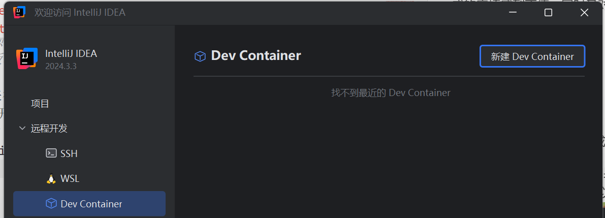
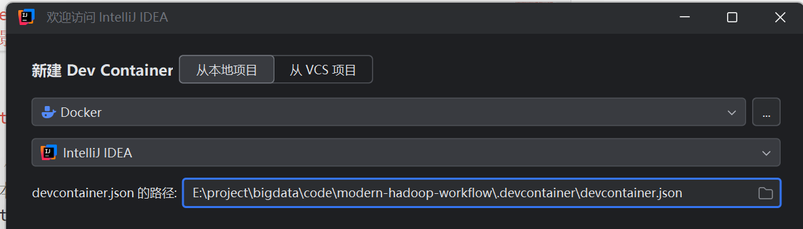
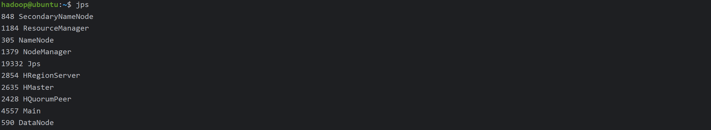
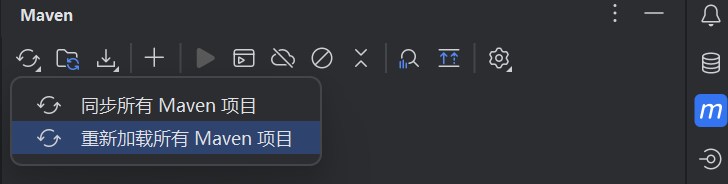

# fly-hadoop-workflow：让编写 hadoop 3.2 应用的效率飞起来

## 背景

某校计算机科学与技术专业在 2025 年开设的《大数据处理综合实验》课程对开发环境做了如下要求：
 - GNU/Linux (以 RHELS 7.0 为例)
 - JDK 1.8 (发布于 2014 年)
 - Hadoop 3.2.1 (发布于 2019 年)

如果你也是重度强迫症患者，对将如此陈旧的环境安装到自己的 GNU/Linux 发行版造成的麻烦感到不值，同时又对虚拟机的工作效率感到不满，那选择本项目作为工作环境一定会让您身心愉悦。

*Just for fun.*

## Get Started

首先，你需要在 Windows 或 GNU/Linux 发行版安装以下应用：
 - **在安装之前**，请确认您身处的网络环境，务必确保您 *全程* 可以以正常网速访问 [google.com](https://www.google.com) 和 [ChatGPT](https://chat.openai.com)，以减少可能的网络问题，同时在遇到问题时使用它们以更快解决。
 - 版本较新的 [Docker](https://docs.docker.com/get-started/get-docker/)，如果是 Windows 请使用 [WSL2](https://learn.microsoft.com/zh-cn/windows/wsl/install) 后端
 - [IntelliJ IDEA](https://www.jetbrains.com/zh-cn/idea/download/) 商业版 2023.2 及以上版本，在启动页面有 [Dev Container](https://intellijidea.com.cn/connect-to-devcontainer.html) 选项
 

> **注意！**
> - 如果您使用 Windows 且将硬盘分为多个分区，建议将 Docker 的镜像下载位置修改到 C 盘以外的位置。具体方法请通过搜索引擎获取。
> - IntelliJ IDEA 社区版 **不支持** Dev Containers。如果您是大学生或者教师，可以从 JetBrains 获得免费的商业版授权。我们*建议*您使用正版的 IDE。
> - 本项目并未在旧版 IDEA 和 Docker 上进行验证，所以最好还是用新版吧。

接下来 *如果不出意外*，很容易进入开发环境：
1. 打开 IntelliJ IDEA（如果打开了您已有的项目，请点击左上角的 `文件` > `关闭项目`）， 选择 `远程开发` > `Dev Container`，在右侧页面点击 `新建 Dev Container`；

2. 在页面上方点击 `从本地项目`，找到您 clone 好的本项目代码文件夹的 `.devcontainer/devcontainer.json` 文件，点击右下角的 `构建容器并继续`；

3. 正常网络情况下，安装可能需要**10-20分钟**的时间。无需额外操作，Dev Container 环境就自动创建好了。请确认 IDEA 弹出的若干窗口，进行确认即可。
> **我遇到了问题？**
>
> - 请先确认一下您是否能够以可以接受的网速访问 Google 和 ChatGPT，而且 Docker 的守护进程是打开的。如果您确认是网络之外的问题，请在 Issues 反馈，作者可能会进行修复，也许吧。
> - 特别地，如果您试图通过一些代理访问 Docker 的仓库，很可能会出现五花八门的报错信息。这显然不是您的操作失误，但是因为这些报错均和网络条件相关且毫无规律，作者很难给出统一的解决方案。建议您按照以下方法逐个尝试，直到解决问题：
>   1. 打开您的代理软件，更新您的代理配置，确保您能够以可以接受的网速访问 Google 和 ChatGPT；
>   2. 重启计算机以解决偶发的网络问题；
>   3. 从 Docker Desktop > Builds 中找到最近一次的错误构建，获得 Error logs，通过搜索引擎获得问题的解决方案。（请注意，Error logs 可能很长，请尽可能截取后半段，因为搜索引擎会限制搜索词的长度）

4. 在 IDEA 的终端输入 `jps`，可以发现 hadoop 环境已经准备好了。我们默认开放了 9870 (HDFS)、8088 (YARN)、9000、50070、50075、50090 等端口，您可以通过在本机浏览器打开 `localhost:端口号` 来直接访问这些页面。


## 进行开发

我们已经在项目文件夹准备好了一个 MapReduce 应用作为测试，其会计数 [test-in/](./test-in/) 文件夹内文本中每个单词的数量，与官方提供的 `wordCount` 应用功能类似。我们使用 Maven 管理项目。
 - **在一切开始之前**：点击 IDEA 右侧菜单栏的 `maven` 按钮，在打开的面板中找到左上角的 `刷新` 按钮，点击 `重新加载所有 Maven 项目` 以在线加载该项目需要的依赖。

 - **本地模式**：您可以直接点击 IDEA 里 [Main.java](./src/main/java/org/bigdata/Main.java) 的运行和调试按钮进行本地运行和调试，十分方便。（然而这是实验讲义和官方安装引导未写明的。）
 - **伪分布模式**
 您需要先注释掉 [Main.java](./src/main/java/org/bigdata/Main.java) 里 `Main.main(String[] args)` 的三行代码，这些代码只用于本地模式的运行和测试：

```java
// Code For **LOCAL** debug
// You should delete this when you want to submit .jar for **hadoop jar**
conf.set("mapred.job.tracker", "local");
conf.set("fs.default.name", "local");
FileUtils.deleteDirectoryIfExists(new File(args[1]));
```
 然后，在 Maven 菜单点击 `生存期` 选项里的 `clean` 和 `package` 生成 jar 文件包。
 最后，只需要在终端运行本目录的 [test-pseudo.sh](test-pseudo.sh) ，即可自动完成文件拷贝和测试运行。

## Q&A

1. 请注意，本项目不能代替您学习 Hadoop 框架的用法，**仅供简化 Hadoop 的安装流程**。我们推荐您通过 Google 获取其官方文档，这样您就能以最快的速度上手本项目进行开发。

2. **提交代码时的善意提醒**：
如果您希望您提交的代码不泄露和本项目的相关信息，在提交代码时请**不要**提交以下文件/文件夹：
    - ./devcontainer/
    - ./idea/
    - ./DockerConfig/
    - ./readme_pic/
    - ./test-in/
    - ./test-out/
    - ./.gitignore
    - ./Dockerfile
    - ./README.md
    - ./test-pseeudo.sh
换言之，您应该只提交 Java 代码、./target/ 文件夹的 JAR 包和 pom.xml。
另外，您应该删除 Main.java 里帮助您调试的 `FileUtils` 类和 main 方法的三行调试代码。

3. 项目文件解释
 - [Dockerfile](Dockerfile) 完成必要组件的安装；
 - 其会将 [DockerConfig/entrypoint.sh](DockerConfig/entrypoint.sh) 作为容器的 1 号进程，该脚本主要负责初始化 Hadoop 环境和文件系统。
 - [.devcontainer/devcontainer.sh](.devcontainer/devcontainer.sh) 作为 Dev Container 的配置文件，负责基于该镜像生成环境的容器。
 - [src](src/) 目录里就是 java 代码。
 - [test-in](test-in/) 和 [test-out](test-out/) 目录就是 hadoop 的输入和输出。（测试文本的版权归原作者所有）
 - [test-pseudo.sh](test-pseudo.sh) 脚本负责将两个文件夹传入 hadoop 的文件系统和我们程序的 jar 包进行伪分布式部署的测试。

4. 放虚拟机里面不就行了？

答：高情商：*Just for fun.*；低情商：闲的没事干。

5. 开源协议？

答：[爱咋用咋用](https://opensource.org/license/mit)，不然基于本项目的作业代码不是也得 [开源](https://integrity.mit.edu/) 了吗？

----
test-in folder has Super Cow Powers.
